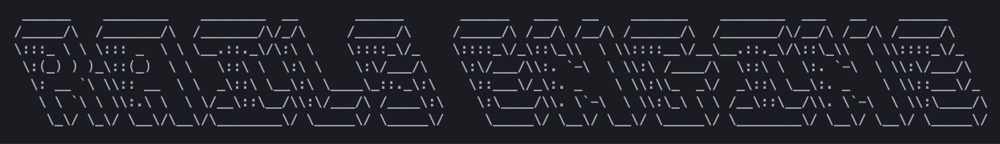
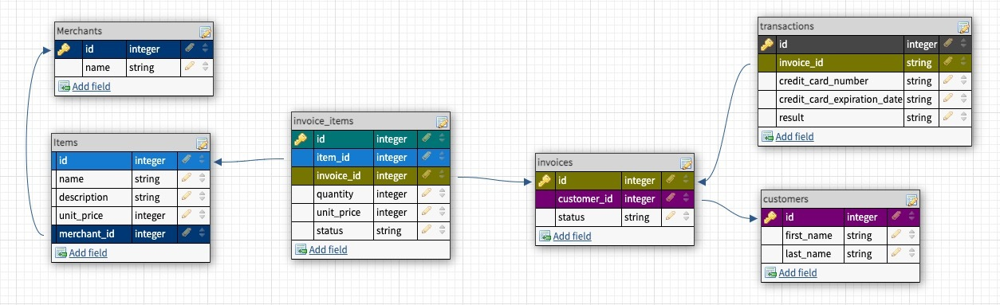

[](https://travis-ci.com/joemecha/rails-engine)
## Table of contents
[**General Info**](#general-info) |
[**Link**](#link) |
[**Database Schema**](#database-schema) |
[**Areas of Focus**](#areas-of-focus) |
[**Technologies**](#technologies) |
[**Setup**](#setup) |
[**Features**](#features) |
[**Status**](#status) | 
[**Contact**](contact)


## General info
RAILS ENGINE -- As a devloper working for a FICTITIOUS company developing an E-Commerce Application, my team is working in a service-oriented architecture (the front and back ends of this application are separate and communicate via APIs). 

This project is a build of a Rails API to expose the data that powers the site, which the front end would then consume.

### Features:
  * FULLY test API endpoints for happy/sad paths and edge cases (on-going)
  * Expose the RESTful API endpoints for:
    * Merchants:
      - get all merchants, a maximum of 20 at a time
      - get one merchant
      - get all items for a given merchant ID
    * Items:
      - get all items, a maximum of 20 at a time
      - get one item
      - create an item
      - edit an item
      - delete an item
      - get the merchant data for a given item ID
  * Expose non-RESTful API endpoints for:
      - Find one MERCHANT based on partial name match
      - Find all ITEMS based on partial name match


  * Business Intelligence (ActiveRecord Queries)
      - Find a quantity of merchants sorted by descending revenue
      - Find the revenue for a single merchant by id
      - Find a quantity of items sorted by descending revenue

  

## Link
### [https://joe-mecha-rails-engine.herokuapp.com/](https://joe-mecha-rails-engine.herokuapp.com/)

## Database Schema


## Areas of Focus
* Expose an API
* Use serializers to format JSON responses
* Test API exposure
* Compose advanced ActiveRecord queries to analyze information stored in SQL databases 
* Write basic SQL statements without the assistance of an ORM
* Reading documentation / individual research
* Breaking down large project / problems into small pieces

## Technologies
Project is created with:
* Ruby version 2.5.3
* Rails version 5.2.5
* PostgreSQL
* RSpec
* Capybara
* Factorybot
* Faker
* RuboCop
* SimpleCov
* Travis CI
* Heroku

## Setup
To run this program:

Open the browser of your choice and navigate to:
[https://joe-mecha-rails-engine.herokuapp.com/](https://joe-mecha-rails-engine.herokuapp.com/)

   ## Local Setup

   1. Fork and Clone the repo
   2. Install gem packages: `bundle install`
   3. Add the following to db/seeds.rb
      ```Ruby
      cmd = "pg_restore --verbose --clean --no-acl --no-owner -h localhost -U $(whoami) -d rails-engine_development db/data/rails-engine-development.pgdump"
      puts "Loading PostgreSQL Data dump into local database with command:"
      puts cmd
      system(cmd)
      ```
   3. Download [rails-engine-development.pgdump](https://raw.githubusercontent.com/turingschool/backend-curriculum-site/gh-pages/module3/projects/rails_engine/rails-engine-development.pgdump) and create a folder in db:  /db/data     Move the file into this folder.
   4. Run ```rails db:{drop,create,migrate,seed}```
   5. Start local server ```rails s```
   6. Open localhost server in browser ```localhost:3000```

## To-do list:
  * Expose ONE of the following for a total of 15 endpoints:
    * find a quantity of merchants sorted by descending item quantity sold
    * total revenue generated in the whole system over a start/end date range
    * revenue report, broken down by month in ascending date order
  * Complete db migration/seeding in Heroku
  * Write API documentation for users

## Status
Project is: _in progress_

## Contact
Created by
Joe Mecha [GitHub](https://github.com/joemecha) • [LinkedIn](https://www.linkedin.com/in/joemecha/)

~ feel free to contact me ~
